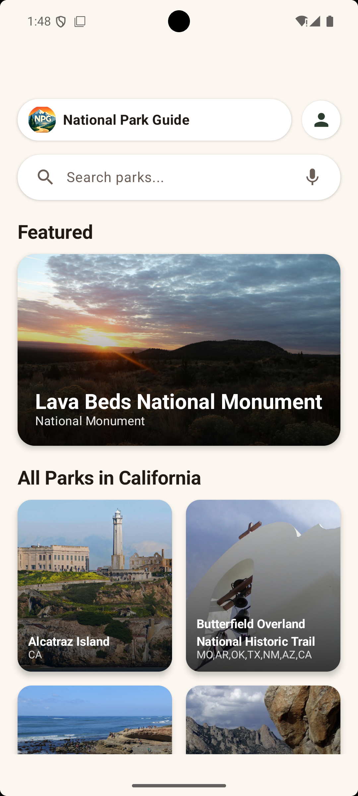
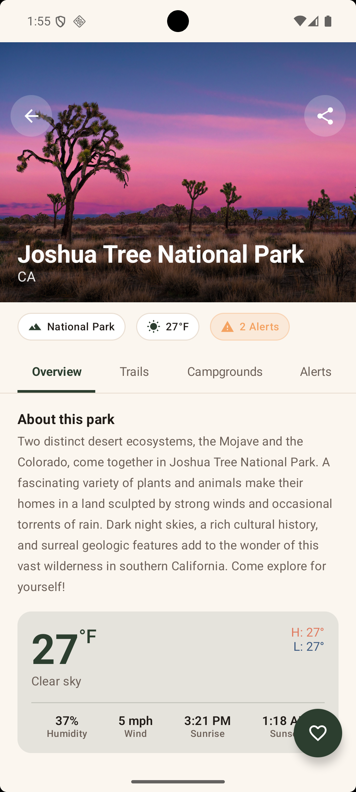
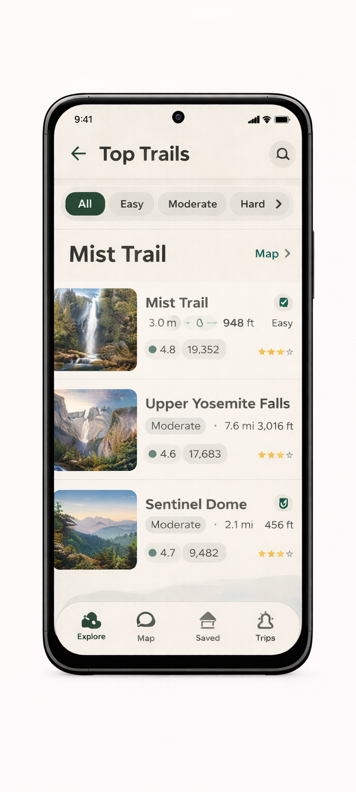
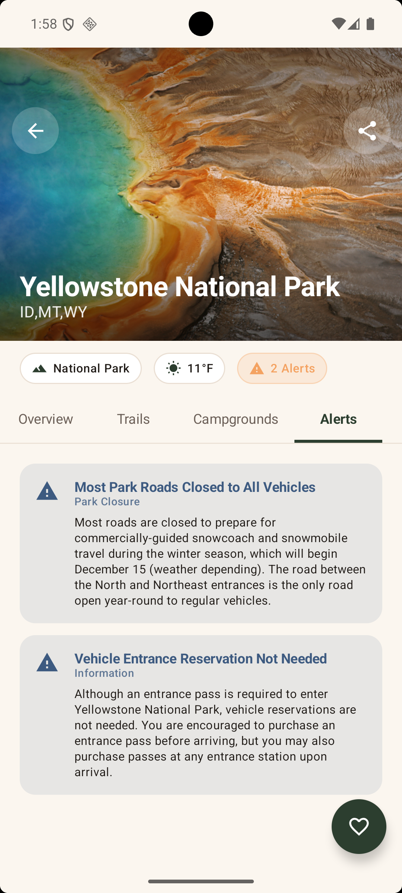

# US National Park Guide

[](https://play.google.com/store/apps/details?id=com.sjani.usnationalparkguide)

Discover America's most spectacular National Parks with rich, detailed information including key features, history, campgrounds, hiking trails, current weather, and alerts. Powered by the [NPS Data API](https://www.nps.gov/subjects/digital/nps-data-api.htm), [Hiking Project Data API](https://www.hikingproject.com/data), and [OpenWeatherMap API](https://openweathermap.org/api).

Perfect for tourists, hikers, and outdoor enthusiasts planning their next adventure to any National Park in the United States.

![NPS App][NPS-app]

[NPS-app]: ./redesign_assets_v1/screenshots/banner.png

## Features

### Explore Parks
- Browse 50+ National Parks with detailed descriptions, history, and key features
- Filter parks by state
- View stunning park imagery and galleries
- Quick access to park operating hours and entrance fees

### Trails & Campgrounds
- Discover hiking trails with difficulty ratings, distance, and elevation data
- Explore campground details with amenities information
- Share trail and campground locations with friends

### Real-time Information
- Current weather conditions for each park
- Active alerts and park closures
- Operating hours and seasonal information

### Personalization
- Save multiple favorite parks
- Beautiful onboarding experience
- Home screen widget with favorite park details
- Google and Email sign-in support

## Tech Stack

### Architecture
- **MVVM** architecture with Repository pattern
- **Kotlin** with Coroutines and Flow for reactive data streams
- **Jetpack Compose** for modern declarative UI
- **Room** database for offline persistence

### UI/UX
- Material Design 3 with custom color theming
- Edge-to-edge display support
- Adaptive layouts for phones and tablets
- Android 12+ Splash Screen API
- Dark/Light theme support

### Libraries
| Category | Library |
|----------|---------|
| UI | [Jetpack Compose](https://developer.android.com/jetpack/compose) with Material 3 |
| Navigation | [Navigation Compose](https://developer.android.com/jetpack/compose/navigation) |
| Networking | [Retrofit](https://square.github.io/retrofit/) + [OkHttp](https://square.github.io/okhttp/) |
| Image Loading | [Coil](https://coil-kt.github.io/coil/) |
| Database | [Room](https://developer.android.com/training/data-storage/room) |
| Authentication | [Firebase Auth](https://firebase.google.com/docs/auth) + [FirebaseUI](https://firebase.google.com/docs/auth/android/firebaseui) |
| Ads | [Google AdMob](https://admob.google.com/) |
| Widgets | [Glance](https://developer.android.com/jetpack/compose/glance) for App Widgets |

### Build Configuration
- **Target SDK**: 35 (Android 15)
- **Min SDK**: 23 (Android 6.0)
- **Kotlin**: 1.9.24
- **Compose BOM**: 2024.11.00

## Screenshots

| Onboarding                                                                    | Home                                                             | Park Details                                                            |
|-------------------------------------------------------------------------------|------------------------------------------------------------------|-------------------------------------------------------------------------|
|            |  |  |
| Trails                                                                        | Campgrounds                                                      | Conditions                                                              |
| --------                                                                      | -------------                                                    | ------------                                                            |
|  |  |       |
## Getting Started

### Prerequisites
- Android Studio Ladybug or later
- JDK 17+
- Android SDK 35

### API Keys
You'll need to obtain API keys for:
1. [NPS API](https://www.nps.gov/subjects/developer/get-started.htm)
2. [Hiking Project API](https://www.hikingproject.com/data)
3. [OpenWeatherMap API](https://openweathermap.org/api)

### Build
```bash
./gradlew assembleDebug
```

## Project Structure

```
app/src/main/java/com/sjani/usnationalparkguide/
├── data/
│   ├── dao/          # Room DAOs
│   ├── database/     # Room Database
│   ├── entity/       # Room Entities
│   ├── model/        # API Response Models
│   ├── network/      # Retrofit API Services
│   └── repository/   # Data Repository
├── ui/
│   ├── components/   # Reusable Compose Components
│   ├── navigation/   # Navigation Routes
│   ├── screens/      # Screen Composables
│   ├── theme/        # Material Theme
│   └── viewmodel/    # ViewModels
├── widget/           # Glance App Widgets
├── MainActivity.kt
└── NPGApplication.kt
```

## Color Palette

| Color | Hex | Usage |
|-------|-----|-------|
| Primary | `#2C3E2F` | Primary brand color |
| Accent | `#E07A5F` | Accent/highlight |
| Background | `#FBF6EF` | App background |
| Surface | `#FFFFFF` | Cards/surfaces |
| Text | `#1F1A16` | Primary text |
| Muted | `#6B5F57` | Secondary text |

## License

```
Copyright 2018-2026, Shaunak Jani

Licensed under the Apache License, Version 2.0 (the "License");
you may not use this file except in compliance with the License.
You may obtain a copy of the License at

  http://www.apache.org/licenses/LICENSE-2.0

Unless required by applicable law or agreed to in writing, software
distributed under the License is distributed on an "AS IS" BASIS,
WITHOUT WARRANTIES OR CONDITIONS OF ANY KIND, either express or implied.
See the License for the specific language governing permissions and
limitations under the License.
```
